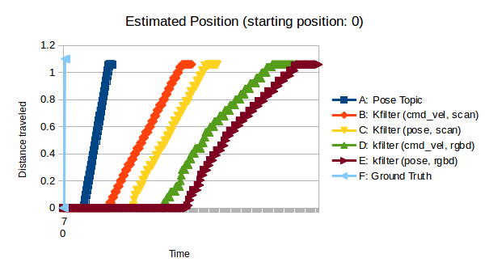
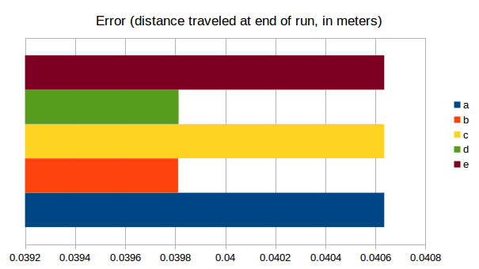

# Programming Assignment 2
Julien Blanchet - CS169 - 2/2/2020

**KEY LINKS**
* Bag file (using Mingi's file) https://drive.google.com/open?id=1onVc88q--nnUFm7Kv0Schqn1i-yoMVre
* Github repository with code https://github.com/j55blanchet/cs169_julienb_pa2

## Description

I was able to implement a kalman filter which performs reasonable state estimation. One of my key design decisions was to refer to the starting point of the robot as position x=0 for the purposes of the pose estimation and kalman filter. I chose this because it seemed to allow for the quickest bootstrapping of a valid localization - if we refer to the starting position as 0, we can start off with a high confidence / low uncertainty in our position. Then, incorporating this choice into a larger map is as simple as publishing a tf transform when we discover elements that allow us to locate / identify the desired map frame. One consequence of this design choice is that, rather than have the state estimation wait for an `initialpose` as the starting state, I start pose estimation immediatly and simply adjust the pose of the `odom_kf` frame relative to world when an initial pose is received.

I opted to seperate the logic for the Kalman Filter into its own class, for reusability purposes. I started off by following the math described in the class slides very closely, however I found this didn't work in context of my decision to use the starting position at 0, because then the "predicted reading" of the scan sensors couldn't be computed by multiplication - it was an addition problem. So, I decided to refactor the filter to take the "expected reading" as an input to the update step, which allows for this flexibility. It's also worth noting that my filter imlementation omitted some transformations that were unnecessary for the current application (such as using the sensor model to transform the Kalman Gain, sensor covariance, and uncertainty measurments). This means that the logic of the filter would need to be modified to support different sensor models.

I collected most data by writing to a file during the state estimation process, with the exception of scenario `a`, for which I wrote a dedicated `datarecorder.py` node.

## Evaluation 

In general, results from my kalman filter impementation appear reasonable, as can be observed from the chart below:

There are a few observations I had on top of this:
1. In contrast to what you would expect with typical robot behavior, my kalman filter performed *more* update operations the propogation operations. This is due to the data collected in the bag file - the `cmd_vel` topic has a low frequency and both the laser scan and depth image messages were coming through considerably faster. This likely led to a lower uncertainty than in typical scenarios because the update cycle leads to increased certainty.
2. The timestamps I used for charting don't seem to line up. With more time, I could fix this.
3. The data from the rgbd camera (converted using `depthimage_to_laserscan`) was filled with `nan`s. To accomodate this, I added a bit of code that searched for valid measurements roughly facing forward, but of course that also decreases accuracy since we're no longer measuring directly straight ahead.
4. I didn't have a systematic method for choosing the noise values for the Kalman filter. I think, in particular, that measurments arising from the RGBD camera should have increased noise, as they didn't look accurate when I examined them individually.

Now, looking at the accuracy of the filter:

In general, the filter was fairly reliable - all measurements were very close to each other. The accuracy was slightly off - already `4cm` error after only 1m of travel. I would typically expect the results from the different input sources to be *more different* from each other. 

## Allocation of Effort
All programming work was done by myself. I used the answers posted in Piazza to help my work, and I used Mingi's bag file as the data source (as I found that `cmd_vel` messages were missing from the bag I collected).
